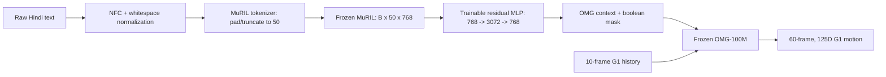

# MAILA core run: Hindi to motion with MuRIL and OMG-100M

This document is the execution runbook for the single approved experiment. It
does not define or run translation, raw-MuRIL, model-size, encoder, LoRA, or
full-fine-tuning baselines.

## Locked objective

Train only a residual adapter that maps frozen MuRIL token states into the
existing 50-token, 768-wide text-conditioning interface of the validated
OMG-100M model.



At inference, no translator, transliterator, English prompt generator, or
English text encoder is called. During training only, the aligned English
caption can be encoded by frozen T5 on 50% of minibatches to supply the
motion-response loss specified in the plan.

The exact trainable block is:

```text
U = LayerNorm(H)
R = Linear_2(Dropout(GELU(Linear_1(U))))
Z = OutputLayerNorm(U + alpha * R)
```

Input/output width is 768, expansion width is 3072, Dropout is 0.1, and the
learned scalar `alpha` starts at 0.1. This is 4,725,505 trainable parameters.
MuRIL, the OMG text projection, the complete denoiser,
history projection, optional modality modules, and T5 remain frozen.

## Data contract already established

The supplied CSV has SHA-256:

```text
2fd9b2b6d51b5095b7cb100548b0ed5249df25c4ff3f82723442d0dfa3b866d9
```

Its audited contents are:

| Item | Count |
| --- | ---: |
| Motion rows | 142,220 |
| Non-mirror motions | 71,132 |
| Mirror motions | 71,088 |
| Candidate English-Hindi pairs | 568,880 |
| Missing Hindi cells | 9 |
| Usable aligned pairs | 568,871 |

Only the nine incomplete caption pairs are skipped; their motions and other
valid caption pairs remain in the run. `filename` is the stable CSV key.
`move_name` must not be used as a fallback key because it differs from
`filename` on 52,508 rows and creates 30 cross-motion alias collisions.

OMG source IDs add derived suffixes such as
`__seg0000__part0002`. The overlay removes only that suffix and resolves the
remaining ID against `filename`. This rule was checked against all 86 BONES
records in the repository's fixed text benchmark, with 86/86 matches.

The CSV is machine-translated supervision. It is suitable for demonstrating
direct Hindi-conditioned inference, but it is not evidence of motion-first
native Hindi annotation or Hinglish understanding. Preserve
`caption_machine_translated=true` in every artifact and do not use stronger
claims for this run.

## 1. Remote prerequisites

Use Python 3.10 and install the repository with the same pinned dependencies
as the reproduced English pipeline:

```bash
uv pip install -e ".[train,data,render,benchmark]"
```

Set immutable paths:

```bash
export OMG_DATA_ROOT=/workspace/data/OMG-Data
export OMG_MODELS_ROOT=/workspace/models
export BONES_HINDI_CAPTION_MANIFEST=/workspace/data/hindi/bones_seed_hi_v1.jsonl
export OMG_100M_CKPT=/workspace/checkpoints/updated/100m/sstep=170000.ckpt
```

The official OMG-Data revision must remain:

```text
6e0dfbc1c5298bff14d4e2b1459ad678af0a38e7
```

Download MuRIL and T5 to local, immutable directories before training. Resolve
and record the full MuRIL repository commit as `MURIL_REVISION`; do not train
against a moving `main` reference.

```bash
export MURIL_REVISION=<full-muril-commit-sha>

hf download google/muril-base-cased \
  --revision "$MURIL_REVISION" \
  --local-dir "$OMG_MODELS_ROOT/muril-base-cased"

hf download google-t5/t5-base \
  --revision <full-t5-commit-sha> \
  --local-dir "$OMG_MODELS_ROOT/t5-base-local"
```

The runtime config uses `local_files_only: true` for MuRIL. A missing local
snapshot therefore fails before training rather than silently changing model
revision.

## 2. Prepare the immutable Hindi caption manifest

Do not alter the source CSV or OMG's task table. Convert the CSV to the
versioned JSONL sidecar:

```bash
mkdir -p /workspace/data/hindi

PYTHONPATH=src python -m omg.cli.data.prepare_bones_hindi_captions \
  --input-csv /workspace/input/seed_metadata_v004__FULLY_TRANSLATED.csv \
  --output-jsonl "$BONES_HINDI_CAPTION_MANIFEST" \
  --dataset-id bones-studio/seed \
  --dataset-revision seed_metadata_v004 \
  --omg-data-revision 6e0dfbc1c5298bff14d4e2b1459ad678af0a38e7
```

Expected preparation counts are exactly:

```text
source_rows=142220
caption_records=568871
skipped_missing_pairs=9
output_jsonl_sha256=8eba5b9dd830d90da073924c266e83c05feff8c8a03161d9a1d0ebdedbf8d349
```

Any different source hash, duplicate key, malformed mirror, empty motion ID,
or zero-caption motion is a hard stop.

## 3. Audit the 50-token MuRIL interface

OMG does not pool or resample text tokens. MuRIL tokenizes each normalized
Hindi string with special tokens, then pads or truncates directly to length
50. The resulting frozen hidden state is `[B, 50, 768]`; the adapter preserves
that shape and passes its boolean attention mask to OMG.

Run the complete corpus audit before the smoke test:

```bash
PYTHONPATH=src python -m omg.cli.data.audit_hindi_token_lengths \
  --input-jsonl "$BONES_HINDI_CAPTION_MANIFEST" \
  --output-json /workspace/data/hindi/muril_token_length_audit.json \
  --tokenizer "$OMG_MODELS_ROOT/muril-base-cased" \
  --tokenizer-revision "$MURIL_REVISION" \
  --max-length 50
```

The report contains min/p50/p90/p95/p99/max, the number and rate above 50,
and the 25 longest captions with the decoded suffix that truncation removes.
Proceed with the fixed 50-token interface only when no more than 2% exceed 50
and inspection confirms that truncated tails do not remove action, side,
direction, count, speed, or event-order information. Otherwise repair or
shorten the affected machine translations; do not add a resampler in this
core run.

## 4. Verify motion-caption alignment and split isolation

Run the metadata-only alignment audit after downloading OMG-Data. It reads
episode parquet metadata but does not run forward kinematics or load motion
frames:

```bash
PYTHONPATH=src python -m omg.cli.data.audit_bones_hindi_alignment \
  --dataset-root "$OMG_DATA_ROOT" \
  --caption-manifest "$BONES_HINDI_CAPTION_MANIFEST" \
  --output-json /workspace/data/hindi/alignment_audit.json
```

Require zero unresolved BONES episodes and zero train/validation/test overlap
for the sidecar `group_id`. This also validates all segmented OMG IDs before a
GPU is occupied.

## 5. Adapter-only smoke run

The updated 100M checkpoint is loaded with a strict core-weight contract. The
old `text_encoder.*` subtree is the only ignored prefix; every denoiser,
history, modality, and output tensor must exist with the exact expected shape.
If the original checkpoint predates embedded architecture metadata, the
experiment config requires the reproduced `self-and-cross` attention contract
explicitly; it never infers QK-normalization semantics from tensor shapes.
`ckpt_path` must not be used because that would restore the old optimizer and
training step.

Run a 32-motion overfit smoke test:

```bash
PYTHONPATH=src python -m omg.cli.generation.train \
  exp=100m_hindi_adapter \
  logger=none \
  init_weights_only_ckpt="$OMG_100M_CKPT" \
  exp_name=100m_hindi_adapter_smoke \
  data.limit_each_trainset=32 \
  data.loader_opts.train.batch_size=8 \
  data.loader_opts.train.num_workers=2 \
  trainer.accumulate_grad_batches=1 \
  trainer.max_steps=500 \
  trainer.val_check_interval=500 \
  callbacks.checkpoint.every_n_train_steps=250
```

Before allowing the full run, require:

- the startup log reports exactly 4,725,505 trainable parameters;
- all trainable names belong to the MuRIL adapter;
- the context and mask are `[B, 50, 768]` and `[B, 50]`;
- loss decreases on the tiny set;
- fixed history/noise with different Hindi prompts changes the prediction;
- no frozen weight changes;
- inference succeeds with `HF_HUB_OFFLINE=1` and no translation package.

This is an integration gate, not a baseline experiment.

## 6. Full core training run

The locked run uses AdamW, learning rate `1e-4`, weight decay `0.01`, 1,000
warmup steps, cosine decay to `1e-6`, bf16, gradient clipping at 1.0, effective
batch 256, and a maximum of 25,000 optimizer steps. As specified in the
trimmed plan, stop early after five consecutive 1,000-step validations without
an improvement in `val/loss`.

```bash
PYTHONPATH=src python -m omg.cli.generation.train \
  exp=100m_hindi_adapter \
  logger=wandb \
  init_weights_only_ckpt="$OMG_100M_CKPT" \
  exp_name=100m_hindi_adapter_bones_seed_v004
```

The single-GPU preset uses per-device batch 64 and accumulation 4. Reduce the
per-device batch only if the first remote memory probe requires it, and raise
accumulation proportionally so the effective batch stays 256.
Do not switch this locked run to a multi-GPU trainer preset.

The loss is:

```text
L_total = L_native + lambda_response * L_response
```

`L_native` is OMG's existing clean-motion diffusion loss. On approximately
50% of minibatches, frozen T5 and the same frozen denoiser predict from the
paired English caption using the exact student `x_t`, timestep, history,
valid-frame mask, and modality decisions. The teacher prediction is detached.
`lambda_response` is 0.5 through step 5,000 and then linearly decays to 0.1 by
step 25,000. Text dropout remains 0.3; response alignment is skipped for any
dropped/no-text sample.

## 7. Translation-free Hindi inference

Use the trained adapter checkpoint with network access disabled. Because the
100M checkpoint retains its audio/human module shapes for strict loading,
explicitly null both unused modalities:

```bash
HF_HUB_OFFLINE=1 TRANSFORMERS_OFFLINE=1 \
PYTHONPATH=src python -m omg.cli.generation.generate \
  --exp 100m_hindi_adapter \
  --ckpt_path /workspace/outputs/100m_hindi_adapter_bones_seed_v004/checkpoints/last.ckpt \
  --text "धीरे-धीरे आगे चलो और फिर दाईं ओर मुड़ो" \
  --num_frames 120 \
  --cfg_scale 2.5 \
  --disable_audio_condition \
  --disable_human_motion_condition \
  --render_video
```

The English teacher is lazy, unregistered, absent from the checkpoint, and is
never constructed by this inference command.

## 8. VAST.ai box specification

Recommended single-box configuration:

| Resource | Recommended | Minimum fallback |
| --- | --- | --- |
| GPU | 1 x H100 SXM 80 GB | 1 x A100 SXM 80 GB |
| GPU interconnect | Not relevant for one GPU | Not relevant |
| Host CPU | 24-32 dedicated vCPU | 16 vCPU |
| Host RAM | 128 GB | 96 GB |
| Local NVMe | 1 TB | 750 GB after verifying dataset size |
| Image | Ubuntu 22.04, Python 3.10, CUDA 12.4-compatible driver/runtime | Same |
| PyTorch | 2.6.x with bf16 CUDA support | Same |
| Network | High-throughput download plus SSH | SSH and enough dataset bandwidth |

Choose H100 80 GB first because it keeps batch 64 and bf16 comfortably while
the frozen denoiser still retains activations needed to backpropagate into the
adapter. A 48 GB L40S or RTX 6000 Ada can be used for code smoke tests with a
smaller microbatch, but it is not the preferred rental for the full timed run.
A 24 GB consumer GPU is outside the planned configuration.

Favor a listing with verified PCIe/SXM health, at least 500 MB/s local disk
throughput, reliable uptime, and enough persistent storage for OMG-Data,
models, checkpoints, generated artifacts, and the original data snapshot.
Rent an initial 24-hour block for setup, manifest audits, smoke training, and a
throughput measurement; extend only after measured steps/hour provides the
full-run estimate.

## 9. Remote handoff and secret handling

Do not paste a private SSH key into chat or commit it to this repository. Add a
short-lived public key to the VAST instance, then provide only the host, port,
username, repository/data paths, and the approved connection method. Remove
the temporary public key when the run is complete.

## 10. Artifacts to retain

- source CSV hash and generated manifest hash;
- OMG-Data revision and release-manifest hash;
- OMG-100M checkpoint filename and SHA-256;
- MuRIL/T5 full revisions and local snapshot hashes;
- token-length and alignment audit JSON files;
- resolved Hydra configuration and exact command;
- smoke and full-run logs;
- Hindi model checkpoint with the recorded architecture contract (the artifact
  contains frozen model weights, although only the adapter is optimized);
- translation-disabled Hindi generation artifacts.

Do not claim native Hindi grounding, Hinglish support, or superiority to a
translation baseline from this single MT-supervised adapter experiment.
