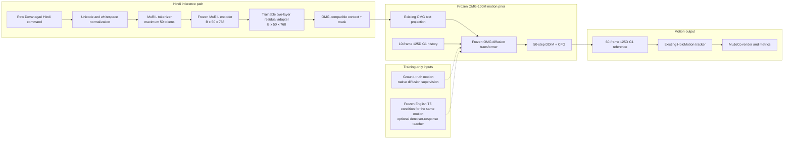
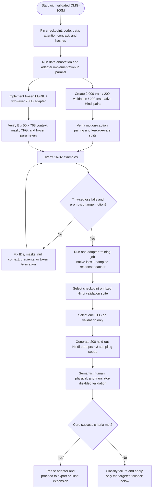

# Core Hindi-to-Motion Adapter Training Plan for OMG

> **Dataset implementation update (2026-08-19):** The user's later decision
> supersedes this document's native-annotation requirement for the current
> feasibility run. The implemented core experiment uses all aligned
> machine-translated English/Hindi pairs in
> `seed_metadata_v004__FULLY_TRANSLATED.csv`, preserves their translation
> provenance, and keeps the architecture and adapter-only training objective
> unchanged. The executable source of truth is
> `work/OMG-repo/docs/hindi_adapter_training.md`. This run can demonstrate
> direct Hindi-conditioned inference, but not native-motion Hindi grounding or
> Hinglish support.

## 1. Goal

Train one compact language adapter that allows the validated OMG-100M motion generator to accept raw Hindi commands and generate corresponding Unitree G1 motion.

The final inference path must be:

```text
raw Devanagari Hindi
    -> MuRIL
    -> trainable Hindi-to-OMG adapter
    -> frozen OMG-100M
    -> 60-frame 125D G1 reference motion
    -> existing tracker/rendering pipeline
```

There must be:

- no Hindi-to-English translation at inference;
- no compulsory transliteration;
- no second language model generating an English prompt;
- no modification to the G1 motion representation;
- no training of another OMG model size.

This is a focused feasibility experiment. It is designed to produce and validate a working direct Hindi-to-motion model. Because comparison runs are intentionally omitted, it cannot by itself establish superiority over translation systems or support broad state-of-the-art claims.

## 2. Locked scope

### Included

- Updated OMG-100M checkpoint already validated in the reproduction work.
- MuRIL as the frozen Hindi language encoder.
- One trainable two-layer 768D conditioning adapter.
- Directly authored Hindi-motion pairs.
- Existing OMG clean-motion diffusion loss.
- Optional training-only English denoiser-response supervision.
- Essential semantic, motion-quality, and integration validation.

### Excluded

- Translation baseline experiments.
- Raw-MuRIL or linear-projection baseline runs.
- OMG-300M experiments.
- IndicBERT, mT5, XLM-R, ByT5, or other encoder sweeps.
- Full OMG fine-tuning.
- Full MuRIL fine-tuning.
- Cross-attention LoRA in the planned run.
- Bengali, Roman Hindi, and Hinglish training in this first experiment.
- Contrastive text-motion evaluator training.
- Audio and human-reference conditioning changes.
- Cultural-motion capture or a new motion representation.
- ONNX/TensorRT and real-robot deployment before the adapter passes validation.

## 3. Fixed OMG configuration

Use the reproduced updated OMG-100M checkpoint with the architecture contract already associated with that artifact:

| Property                 | Fixed value                                          |
| ------------------------ | ---------------------------------------------------- |
| Backbone                 | OMG-100M                                             |
| Motion representation    | 125D G1 representation                               |
| History                  | 10 frames                                            |
| Predicted horizon        | 60 frames                                            |
| Frame rate               | 30 FPS                                               |
| Diffusion target         | Clean motion / `x0`                                  |
| Sampler                  | 50-step DDIM                                         |
| CFG                      | Start with 2.5; select once on Hindi validation data |
| Text interface           | Maximum 50 context tokens, width 768                 |
| Trainable OMG parameters | None                                                 |

Before training, record:

- repository Git commit;
- OMG-Data revision;
- checkpoint filename and SHA-256;
- self-attention and cross-attention QK-normalization settings;
- normalization-statistics file hash;
- tokenizer and MuRIL revision;
- prompt, history, and random-seed manifests.

Run the already-recorded attention-contract check once. This is an integrity check, not a new baseline experiment. Require the expected reference `R@1 = 0.6680`; do not begin adapter training unless that fixed result is reproduced with the intended attention configuration.

## 4. Architecture



The English teacher path is absent during Hindi inference.

## 5. Hindi adapter specification

### 5.1 Input contract

The adapter receives:

- MuRIL contextual token states `H` with shape `[B, L, 768]`;
- the MuRIL attention mask with shape `[B, L]`;
- `L <= 50` after deterministic padding or truncation.

Audit token lengths on the complete training and validation caption set before training. If more than 2% of captions exceed 50 tokens, inspect whether action-bearing words are being removed. Because this experiment uses short imperative Hindi commands, the default action is to keep the 50-token interface. Only introduce a 96-to-50 attentive resampler if meaningful content is actually truncated; this is an implementation correction, not a separate experiment.

### 5.2 Adapter block

Use a compact residual multilayer perceptron applied independently to the contextualized MuRIL tokens:

```text
U = LayerNorm(H)
R = Linear_2(Dropout(GELU(Linear_1(U))))
Z = OutputLayerNorm(U + alpha * R)
```

Recommended settings:

| Component                 | Value                              |
| ------------------------- | ---------------------------------- |
| Hidden/input/output width | 768                                |
| MLP expansion             | 4x, or 3072 hidden units           |
| Activation                | GELU                               |
| Dropout                   | 0.1                                |
| Residual scale `alpha`    | Learnable, initialized to 0.1      |
| Output                    | `[B, 50, 768]` plus `[B, 50]` mask |

MuRIL already contextualizes tokens, so a large additional transformer is unnecessary for the first experiment. The adapter's job is to transform MuRIL's representation geometry into a context that the frozen OMG cross-attention can use.

### 5.3 Frozen and trainable parameters

Freeze:

- every MuRIL parameter;
- original T5 encoder;
- OMG text projection;
- all OMG cross-attention, temporal self-attention, feed-forward, and output layers;
- motion representation and normalization;
- audio and human-reference adapters;
- HoloMotion tracker.

Train only:

- the two-layer Hindi adapter;
- its LayerNorm parameters;
- its learned residual scale;
- a learned native null-context tensor if required for classifier-free guidance.

This should leave only a few million trainable parameters and substantially reduce memory, training time, and catastrophic forgetting risk.

## 6. Minimum Hindi-motion dataset

### 6.1 Recommended size

| Split      | Unique source motions | Hindi captions |
| ---------- | --------------------: | -------------: |
| Train      |                 2,000 |  2,000 minimum |
| Validation |                   200 |            200 |
| Test       |                   200 |            200 |

One high-quality command per motion is sufficient for the core run. If annotation capacity permits, collect a second Hindi paraphrase for approximately 25% of the training motions. Do not delay the experiment while attempting to annotate the full OMG dataset.

An absolute minimum technical pilot is 1,000 training motions, but the preferred 2,000 should be used if the annotation team can produce them within the sprint.

### 6.2 Motion selection

Sample distinct source motions rather than overlapping 60-frame windows. Stratify the selected motions across:

- walking, running, turning, stopping, and other locomotion;
- upper-body gestures;
- lower-body and full-body actions;
- left/right actions;
- forward/backward and rotational direction;
- slow/normal/fast motion;
- one-step and two-event motions where clearly visible.

Keep all windows, crops, mirrored versions, and near-duplicate sequences from one source motion in the same split.

### 6.3 Native annotation protocol

1. Show the annotator a clear multi-view render of the motion.
2. Hide the existing English caption.
3. Ask for one natural Devanagari Hindi command describing the visible action.
4. Prefer concise imperatives, for example the natural equivalent of "walk forward slowly" rather than an elaborate story.
5. Record action, side, direction, speed, count, and temporal order when those properties are visually observable.
6. Have a second annotator verify the caption-motion match for validation and test examples.
7. Reveal the English caption only after native annotation, solely to connect the training-only teacher response or resolve an annotation mistake.

Do not generate the gold Hindi caption by translating the English source. Machine translation may not create or replace the native test set.

### 6.4 Caption sidecar

Do not overwrite OMG's original task table or materialized caption cache. Create a sidecar record such as:

```yaml
dataset_revision: <pinned OMG-Data revision>
source_motion_id: <stable source identifier>
episode_id: <OMG episode>
window_start: <frame index>
caption_id: <stable native caption id>
language: hi
script: Devanagari
text: <native Hindi command>
action: <optional structured label>
side: <left/right/none/ambiguous>
direction: <optional>
speed: <optional>
count: <optional>
order: <optional>
english_visible_to_annotator: false
machine_assisted: false
split: train|validation|test
```

## 7. Training objective

Use one primary native loss and one training-only auxiliary loss:

\[
\mathcal{L}_{total}
= \mathcal{L}_{native}

- \lambda*{resp}\mathcal{L}*{response}.
  \]

### 7.1 Direct native diffusion loss

For a ground-truth motion `x0`, sampled diffusion timestep `t`, noisy motion `xt`, history `h`, and Hindi condition `c_hi`:

\[
\mathcal{L}_{native}
= \mathcal{L}_{OMG}\left(
x*0,
f*{OMG}(x*t,t,h,A(E*{MuRIL}(c\_{hi})))
\right).
\]

Use the same clean-motion loss implementation and reduction as the reproduced OMG training pipeline. This is the dominant objective and directly teaches the adapter that Hindi expressions should select the corresponding motion.

### 7.2 Motion-response teacher loss

For training motions that already have an English caption `c_en`:

1. Use the frozen T5 and frozen OMG to predict clean motion from `c_en`.
2. Use MuRIL, the trainable adapter, and the same frozen OMG to predict from the directly authored Hindi `c_hi`.
3. Use the same ground-truth motion, history, noise realization, and timestep in both branches.
4. Stop gradients through the English branch.
5. Match the predicted clean-motion responses.

\[
\mathcal{L}_{response}
= \left\|
\operatorname{sg}[\hat{x}_{0,en}]

- \hat{x}\_{0,hi}
  \right\|\_2^2.
  \]

This is motion-response alignment, not text translation. The model never predicts or consumes an English sentence in the Hindi inference path.

To control training cost, compute the English teacher on approximately 50% of minibatches rather than every minibatch.

### 7.3 Loss schedule

Use:

```text
lambda_native = 1.0 throughout training
lambda_response = 0.5 for the first 5,000 steps
lambda_response linearly decays from 0.5 to 0.1 afterward
```

Classifier-free text dropout should remain consistent with OMG, initially 0.3. Apply response alignment only when both language conditions are present, not on dropped-condition examples.

## 8. Single-run training schedule

### Phase 0 - Artifact and data check

- Verify checkpoint/attention contract and hashes.
- Validate all sidecar IDs against the pinned OMG-Data revision.
- Confirm there is no source-motion overlap between splits.
- Measure MuRIL token lengths and finalize the 50-token policy.

Exit condition: every caption resolves to the correct motion, and the fixed OMG checkpoint produces valid motion with the established English setup.

### Phase 1 - Adapter smoke tests

- Confirm output context shape `[B, 50, 768]` and mask `[B, 50]`.
- Run a forward and backward pass with all non-adapter gradients disabled.
- Overfit 16-32 Hindi-motion examples.
- Generate the same history/noise with several different Hindi prompts and verify that conditional outputs diverge.
- Compare conditional and null-condition outputs to verify CFG is actually using the Hindi context.
- Run inference with network access and translator packages disabled.

Exit condition: the tiny subset overfits, gradients reach the adapter, prompt changes affect motion, and Hindi inference has no translation dependency.

### Phase 2 - Full adapter training

Recommended starting configuration:

| Parameter              | Value                            |
| ---------------------- | -------------------------------- |
| Optimizer              | AdamW                            |
| Adapter learning rate  | `1e-4`                           |
| Weight decay           | `0.01`                           |
| Warmup                 | 1,000 optimizer steps            |
| Schedule               | Cosine decay toward `1e-6`       |
| Precision              | bf16                             |
| Gradient clipping      | Global norm 1.0                  |
| Effective global batch | 256 or larger using accumulation |
| Maximum steps          | 25,000                           |
| Validation interval    | Every 1,000 steps                |
| Checkpoint interval    | Every 2,000 steps                |
| Development seed       | One fixed seed                   |

Select the final checkpoint using a compact Hindi validation score combining:

- native diffusion validation loss;
- action/direction correctness on a fixed 50-prompt validation suite;
- condition-sensitivity score;
- contact-slide and jerk sanity checks.

Do not select solely by training loss.

Stop early if the validation score does not improve for five consecutive validations.

### Phase 3 - Fixed test generation

- Freeze the selected adapter checkpoint.
- Select one CFG value from `2.0`, `2.5`, and `3.0` using only validation prompts.
- Generate all 200 test prompts with three sampling seeds.
- Use identical history-selection rules and sampler settings for every prompt.
- Save normalized and denormalized motion, qpos/reference artifacts, metadata, and rendered videos.

No model or CFG changes are allowed after viewing test results.

## 9. Focused validation

Validation is required to determine whether Hindi conditioning works; it is not a baseline experiment.

### 9.1 Test composition

Divide the 200 test prompts into five groups of 40:

1. simple action and locomotion;
2. body part and left/right distinction;
3. direction and turning;
4. speed and repetition count;
5. unseen Hindi paraphrases and two-event commands.

### 9.2 Semantic checks

Measure:

- action correctness;
- requested body part;
- left/right correctness;
- forward/backward/turn direction;
- slow/normal/fast behavior;
- repetition count when measurable;
- event-order correctness for the small two-event subset.

Use kinematic rules where reliable and native-speaker video judgments elsewhere.

### 9.3 Human review

For at least 100 test prompts:

- use three Hindi-speaking raters when possible;
- hide checkpoint and seed information;
- show the Hindi command with the generated video;
- rate semantic correctness and motion quality separately;
- allow `correct`, `partially correct`, `incorrect`, and `unclear prompt`;
- record the specific failure category rather than only an overall score.

### 9.4 Motion-quality checks

Reuse the existing OMG metrics and tracker pipeline:

- contact slide or foot skating;
- body jerk and acceleration;
- root-trajectory discontinuity;
- joint-limit violations;
- falls or unstable tracker execution;
- tracker MPJPE or the existing tracking error measure.

Use the already validated 100M reproduction values as a safety reference; no new baseline training is required.

### 9.5 Core success criteria

Treat the experiment as successful if:

- Hindi conditioning works with all translators and network access disabled;
- at least 70% of simple-action prompts are judged semantically correct;
- at least 60% of the side/direction/speed/count prompts are correct;
- prompt changes under fixed history/noise produce corresponding motion changes rather than nearly identical samples;
- no material increase in falls or joint-limit violations is observed;
- selected physical metrics remain within approximately 10% of the established OMG-100M reproduction values;
- the model produces valid motion for at least 95% of test generations.

These are project acceptance targets, not expected results or literature claims.

## 10. Code changes

### 10.1 New modules

Suggested files:

```text
src/omg/generation/conditions/muril.py
src/omg/generation/conditions/hindi_adapter.py
src/omg/data/hindi_caption_sidecar.py
configs/generation/conditions/hindi_muril_adapter.yaml
configs/generation/exp/100m_hindi_adapter.yaml
tests/generation/test_hindi_condition.py
tests/data/test_hindi_caption_sidecar.py
```

### 10.2 Conditioner interface

The Hindi conditioner must match the existing text-condition contract:

```python
{
    "context": context,  # [B, 50, 768]
    "mask": mask,        # [B, 50]
}
```

The motion generator should choose the Hindi conditioner through configuration, not by inserting language-specific branches throughout the denoiser.

### 10.3 Dataset behavior

The data wrapper should:

- load the original OMG motion/history exactly as before;
- resolve the Hindi caption from the sidecar;
- expose the source English caption only to the optional teacher branch;
- prevent English text from replacing the Hindi student input;
- retain stable IDs for reproducibility;
- reject split leakage and missing sidecar entries during initialization.

### 10.4 Checkpoint metadata

Store:

- OMG checkpoint hash and attention contract;
- MuRIL model ID, revision, and tokenizer hash;
- adapter architecture and parameter count;
- maximum token length and normalization policy;
- loss weights and teacher sampling probability;
- data-sidecar revision;
- training command and resolved configuration.

## 11. Focused execution flow



## 12. Targeted fallback - only if the adapter fails

Do not add more models or datasets immediately. Diagnose the failure:

| Observed failure                                           | First action                                                                      |
| ---------------------------------------------------------- | --------------------------------------------------------------------------------- |
| No gradient or no prompt sensitivity                       | Fix mask, condition dropout, null context, or detached tensors                    |
| Training loss falls but all prompts produce similar motion | Increase response-loss sampling; verify Hindi-motion pair diversity               |
| Commands are truncated                                     | Enable the 96-to-50 attentive resampler                                           |
| Valid motion but side/direction is ignored                 | Continue from the adapter checkpoint with rank-8 LoRA on cross-attention K/V only |
| Motion quality collapses                                   | Lower adapter LR, reduce residual scale, and select an earlier checkpoint         |
| Good training results but weak test results                | Audit motion-family leakage and annotation naturalness before adding capacity     |

The K/V LoRA fallback is not part of the planned core experiment. Use it only when the frozen adapter demonstrably produces valid motion but lacks sufficient language control. Keep all temporal layers frozen.

## 13. Suggested two-week sprint

Assuming the existing environment is functional and data annotation and implementation proceed in parallel:

| Days  | Work                                                      | Exit condition                                     |
| ----- | --------------------------------------------------------- | -------------------------------------------------- |
| 1     | Pin artifacts and finish integrity checks                 | Reproducible OMG-100M contract                     |
| 1-4   | Direct Hindi annotation and split QA                      | Minimum sidecar ready                              |
| 1-4   | MuRIL wrapper, adapter, loader, and tests                 | One-batch forward/backward passes                  |
| 5     | Tiny-set overfit and CFG/translation-disabled smoke tests | Adapter demonstrably controls output               |
| 6-9   | One full adapter training run                             | Best validation checkpoint selected                |
| 10    | CFG selection and fixed test generation                   | Test artifact set frozen                           |
| 11-13 | Semantic, human, and physical evaluation                  | Core metrics and failure labels complete           |
| 14    | Final report and go/no-go decision                        | Adapter frozen or one targeted fallback authorized |

If annotation falls behind, reduce training motions toward 1,000 before reducing the 200-motion test set. A trustworthy held-out evaluation is more valuable than additional overlapping training windows.

## 14. Definition of done

The core experiment is complete when the following artifacts exist:

- versioned native Hindi caption sidecar and split manifest;
- frozen MuRIL and trained adapter configuration;
- selected adapter checkpoint with full provenance metadata;
- translator-disabled Hindi inference command;
- fixed validation/test prompts, histories, CFG, and seeds;
- 200-prompt test generations for three seeds;
- semantic and physical metric report;
- native-speaker review results;
- representative success and failure videos;
- explicit decision to freeze, apply the targeted fallback, or stop.

## 15. Final recommended experiment

In one sentence:

> Train a two-layer residual adapter between frozen MuRIL and frozen OMG-100M on 2,000 directly authored Hindi-motion pairs, using OMG's native diffusion loss plus sampled training-only English motion-response distillation, and validate it on 200 held-out Hindi prompts with translation disabled.

This is the shortest technically defensible path to a working native Hindi-to-motion system without spending time on baseline setup.

## 16. Primary references

- [OMG: Omni-Modal Motion Generation for Generalist Humanoid Control](https://arxiv.org/abs/2606.10340)
- [Official OMG repository](https://github.com/Tsinghua-MARS-Lab/OMG)
- [Official OMG checkpoint artifacts](https://huggingface.co/THU-MARS/OMG)
- [MuRIL: Multilingual Representations for Indian Languages](https://arxiv.org/abs/2103.10730)
